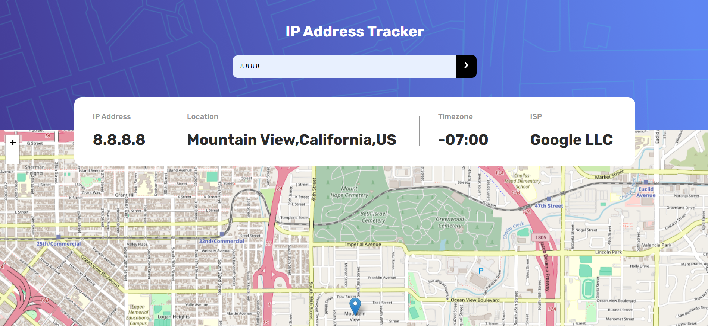

# IP Address Tracker

An interactive web app that lets users visualize the geographic location of any IP address on a map, complete with relevant details like region, city, and more.

## Screenshot


## Features

- Input any IP address to see its location on a map.
- Display detailed info (e.g., city, region, timezone).
- Visually maps the location using JavaScript and mapping libraries (e.g., Leaflet/OpenStreetMap).

## Project Structure
├── index.html # Entry point
├── style.css # Styling and layout
├── main.js # Core functionality and API integration
└── images/ # Optional: assets like icons or sample images


## Getting Started

### Prerequisites

- A modern web browser (Chrome, Firefox, Safari, Edge).

### Running Locally

1. Clone the repo:
   ```bash
   git clone https://github.com/Thunderer9506/IP-Address-Tracker.git
2. Navigate into the folder:
    ```bash
    cd IP-Address-Tracker
3. Open index.html directly in your browser.

(Optional: use a local server like Live Server extension in VSCode or http-server via npm for better compatibility.)

## Usage
1. Enter an IP address into the input field.

2. Submit to fetch location data via an IP geolocation API.

3. View the results (coordinates, city, region, etc.) plotted on the integrated map.

## Supported APIs
- (Specify the IP geolocation API you're using — e.g., IPify, ipstack, IP Geolocation API, etc.)

- If required, include steps to insert your API key (e.g., in main.js).

## Customization Tips
- Style the layout using style.css (fonts, colors, layout).

- Swap map implementations (e.g., Leaflet → Mapbox or Google Maps).

- Add enhanced features: search history, error handling, geolocation modes, etc.

Contribution Guidelines
- Fork the repository.

- Create your feature branch:
    ```bash
    git checkout -b feature/YourFeature
- Commit your changes:
    ```bash
    git commit -m "Add [feature]"
- Push to your branch:
    ```bash
    git push origin feature/YourFeature
- Open a pull request—happy to review your enhancements!
